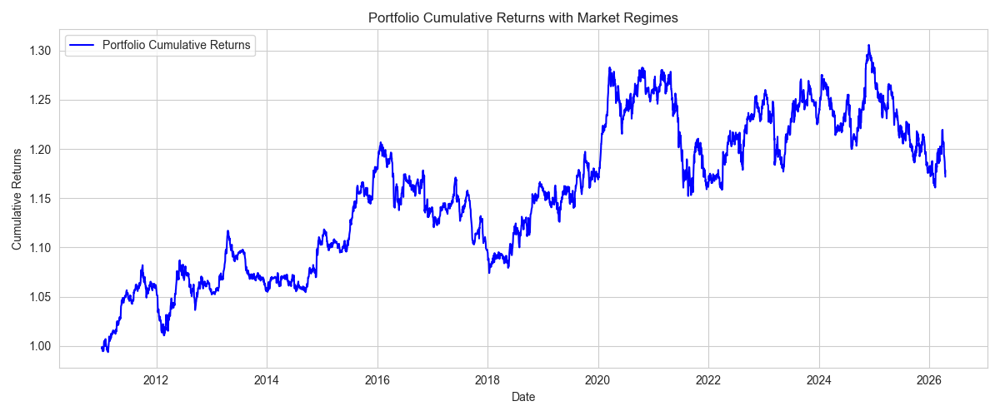

# HiddenMarketDNA

**Détection de régimes de marché par PCA rolling, portefeuille market-neutral, et — en extension personnelle — modèle multi-facteurs, régimes HMM/GARCH et exécution live via IBKR.**



---

## 🇫🇷 Version française

### Vue d'ensemble

Les marchés financiers semblent bruités, mais leurs mouvements sont souvent pilotés par un petit nombre de facteurs latents communs. HiddenMarketDNA part de cette idée : appliquer une **PCA rolling** à des ETF sectoriels américains pour extraire ces facteurs, détecter les régimes de marché à partir de leur volatilité, et construire un **portefeuille market-neutral** qui ajuste son exposition dynamiquement.

Le projet est né comme un exercice de recherche quantitative (voir *Cœur du projet* ci-dessous), puis j'ai continué à le développer en autodidacte jusqu'à un système de trading systématique complet, avec exécution automatisée (voir *Extension personnelle*). Les deux parties sont clairement séparées ci-dessous — je peux défendre chaque ligne du cœur du projet à partir de mon cursus actuel (ING2, Modélisation Mathématique pour la Finance et l'Assurance) ; l'extension va au-delà du programme et représente du temps personnel investi par curiosité.

### Progression du projet

Le pipeline (`main.py`) est construit comme une succession de « sprints » activables un par un, chacun ajoutant une brique :

| Sprint | Ajout | Origine |
|---|---|---|
| 1 | PCA statique + rolling, détection de régime par seuil de volatilité de PC1 |  Cœur du cursus |
| 2 | Modèle multi-facteurs (momentum cross-sectionnel, quality) |  Cœur du cursus (économétrie financière) |
| 3 | Régimes de marché par **HMM gaussien** (Baum-Welch, implémenté from scratch en NumPy) + GARCH |  Extension personnelle |
| 4 | Construction de portefeuille optimisée (Mean-Variance, Risk Parity / Equal Risk Contribution) |  Cœur du cursus (optimisation, gestion de portefeuille) |
| 5 | Exécution live paper trading via IBKR, alertes Telegram, automatisation Windows Task Scheduler |  Extension personnelle |

###  Cœur du projet

**PCA & détection de régime**
- PCA sur 8 ETF sectoriels US (XLK, XLF, XLE, XLV, XLI, XLY, XLP, XLU), rendements log
- Interprétation économique : PC1 = facteur de marché global, PC2 = rotation sectorielle
- **Rolling PCA** (fenêtre 252 jours) pour capturer l'évolution de la structure factorielle dans le temps
- Régime détecté par un seuil empirique sur la volatilité de PC1 : haute volatilité de PC1 → marché stressé

**Portefeuille market-neutral**
- Exposition nette nulle au facteur de marché (PC1), exposition ciblée sur PC2
- Neutralisation de facteurs par projection/reconstruction PCA (`src/pca_neutralization.py`)
- Réduction dynamique de l'exposition en régime de stress

**Modèle multi-facteurs (Sprint 2)**
- Momentum cross-sectionnel façon Jegadeesh & Titman (1993) : lookback 12 mois, skip 1 mois pour éviter le short-term reversal
- Score de qualité par secteur
- Combinaison pondérée des signaux (`src/factors/composite.py`)

**Construction de portefeuille optimisée (Sprint 4)**
- Mean-Variance Optimization avec shrinkage de covariance Ledoit-Wolf
- Risk Parity / Equal Risk Contribution (chaque actif contribue également au risque total, pas seulement au capital)
- Contraintes réalistes : levier 2x, 15% max par actif, marché-neutre

**Backtesting**
- Backtest walk-forward strictement out-of-sample, sans *look-ahead bias*
- Métriques : Sharpe, drawdown, contribution des facteurs

###  Extension personnelle (au-delà du programme)

Cette partie a été développée en autodidacte après le cœur du projet, par curiosité pour aller jusqu'au bout de l'idée (recherche → système en production). Je suis transparent sur le niveau : c'est un travail d'exploration personnelle, pas une compétence que je revendique maîtriser à un niveau professionnel.

- **`src/regimes/hmm_detector.py`** — Hidden Markov Model gaussien à états multiples, implémenté en NumPy pur : algorithme de Baum-Welch (EM) pour l'apprentissage des paramètres, forward-backward en échelle logarithmique pour les probabilités a posteriori. Objectif : détecter la *transition* calme→stress avant que la volatilité n'explose complètement, plutôt que de réagir après coup comme le seuil PC1 du Sprint 1.
- **`src/regimes/garch_vol.py`** — volatilité conditionnelle GARCH en complément du HMM.
- **`src/execution/`** — client IBKR (`ib_insync`), conversion des poids cibles en ordres, garde-fous de risque avant envoi (`RiskGuard` : vérification du marché ouvert, du levier, de la taille de position, du drawdown).
- **`src/live_trader.py`** — boucle hebdomadaire complète : connexion IBKR → récupération du compte → génération du signal (PCA + Momentum + HMM/GARCH) → contrôle de risque → calcul et envoi des ordres → notification Telegram.
- **`scripts/`** — automatisation via Windows Task Scheduler (exécution chaque lundi).

 Système testé uniquement en **paper trading** (compte de simulation IBKR, aucun argent réel). Les paramètres de connexion (hôte, port, identifiant client) sont configurables via variables d'environnement — voir `.env.example`.

### Structure du projet

```
HiddenMarketDNA/
├── main.py                        # Pipeline principal (sprints 1-4, backtest)
├── dashboard.py                   # Dashboard Streamlit de suivi
├── src/
│   ├── data_loader.py             # Chargement des prix
│   ├── returns.py                 # Rendements logarithmiques
│   ├── pca_engine.py              # PCA (fit/transform/eigen-portfolios)
│   ├── pca_neutralization.py      # Neutralisation de facteurs
│   ├── rolling_backtest.py        # Backtest rolling PCA (Sprint 1)
│   ├── portfolio_engine.py        # Construction du portefeuille market-neutral
│   ├── diagnostics.py             # Diagnostics PCA
│   ├── performance.py             # Métriques de performance
│   ├── visualization.py           # Graphiques régimes/portefeuille
│   ├── generate_csv.py            # Export des résultats
│   ├── factor_backtest.py         # Backtest multi-facteurs (Sprint 2/3)
│   ├── factors/                   #  momentum, quality, composite
│   ├── regimes/                   #  HMM (from scratch), GARCH, gestion des régimes
│   ├── optimization/              #  Mean-Variance, Risk Parity, contraintes
│   ├── data/                      #  pipeline de données (fetch/clean/univers)
│   ├── execution/                 #  client IBKR, gestion des ordres, garde-fous risque
│   ├── live_trader.py             #  boucle de trading live
│   ├── telegram_notify.py         #  notifications Telegram
│   └── utils/
├── scripts/                       #  automatisation Windows Task Scheduler
├── notebooks/
│   ├── 01_exploration.ipynb
│   ├── 02_pca_static.ipynb
│   └── 03_pca_rolling.ipynb
├── data/raw/                      # 8 ETF sectoriels (CSV)
├── reports/figures/
├── tests/
│   └── test_core.py               # Tests du cœur (returns, PCA)
├── requirements.txt
├── .env.example
└── LICENSE
```

### Installation

```bash
git clone <url-du-dépôt>
cd HiddenMarketDNA
python -m venv venv
source venv/bin/activate        # Windows : venv\Scripts\activate
pip install -r requirements.txt
cp .env.example .env            # puis renseigner tes propres valeurs si tu utilises le live trading
```

### Utilisation

```bash
# Backtest — éditer les constantes en tête de main.py pour choisir le sprint
# (USE_FACTORS, USE_ADVANCED_REGIMES, USE_OPTIMIZER, OPTIMIZER_METHOD)
python main.py

# Dashboard de suivi
streamlit run dashboard.py

# Live trading paper (nécessite TWS/IB Gateway ouvert + .env configuré)
python -m src.live_trader --dry-run   # simulation, aucun ordre envoyé
python -m src.live_trader             # exécution réelle (paper account)
```

### Tests

```bash
pytest tests/
```

Les tests couvrent le cœur du projet : calcul des rendements log (dont le rejet de prix non positifs) et le moteur PCA (composante dominante sur des actifs corrélés, erreurs explicites avant `fit()`).

### Stack technique

Python · pandas · NumPy · scikit-learn (PCA, Ledoit-Wolf) · SciPy (optimisation) · statsmodels/arch (GARCH) · ib_insync · Streamlit/Plotly · pytest

### Limites & disclaimer

- Univers limité à 8 ETF sectoriels US — pas encore de portefeuille multi-classes d'actifs.
- Le HMM et l'exécution live sont un travail d'exploration personnelle ; je continue à approfondir la théorie derrière (notamment les équations de Baum-Welch) plutôt que de m'arrêter à l'implémentation.
- Ceci est un projet de recherche personnel testé exclusivement en paper trading — **ce n'est pas un conseil en investissement**, et rien ici n'a vocation à être utilisé avec de l'argent réel sans validation supplémentaire.

---

## 🇬🇧 English version

### Overview

Financial markets look noisy, yet their movements are often driven by a small number of latent common factors. HiddenMarketDNA starts from that idea: apply **rolling PCA** to US sector ETFs to extract these factors, detect market regimes from their volatility, and build a **market-neutral portfolio** that dynamically adjusts its exposure.

The project started as a quantitative research exercise (see *Core* below), then I kept building on it independently, all the way to a full systematic trading system with automated execution (see *Personal extension*). The two parts are clearly separated below — I can defend every line of the core from my current coursework (2nd-year engineering, Mathematical Modelling for Finance & Insurance); the extension goes beyond the syllabus and represents personal time invested out of curiosity.

### Project progression

The pipeline (`main.py`) is built as a sequence of togglable "sprints", each adding one building block:

| Sprint | Adds | Origin |
|---|---|---|
| 1 | Static + rolling PCA, regime detection via a PC1 volatility threshold |  Core coursework |
| 2 | Multi-factor model (cross-sectional momentum, quality) |  Core coursework (financial econometrics) |
| 3 | Market regimes via a **Gaussian HMM** (Baum-Welch, implemented from scratch in NumPy) + GARCH |  Personal extension |
| 4 | Optimized portfolio construction (Mean-Variance, Risk Parity / Equal Risk Contribution) |  Core coursework (optimization, portfolio management) |
| 5 | Live paper-trading execution via IBKR, Telegram alerts, Windows Task Scheduler automation |  Personal extension |

###  Core of the project

**PCA & regime detection**
- PCA on 8 US sector ETFs (XLK, XLF, XLE, XLV, XLI, XLY, XLP, XLU), log-returns
- Economic interpretation: PC1 = global market factor, PC2 = sector rotation
- **Rolling PCA** (252-day window) to capture the evolving factor structure over time
- Regime flagged by an empirical threshold on PC1 volatility: high PC1 volatility → stressed market

**Market-neutral portfolio**
- Zero net exposure to the market factor (PC1), targeted exposure to PC2
- Factor neutralization via PCA projection/reconstruction (`src/pca_neutralization.py`)
- Dynamic exposure scaling down during stress regimes

**Multi-factor model (Sprint 2)**
- Cross-sectional momentum à la Jegadeesh & Titman (1993): 12-month lookback, 1-month skip to avoid short-term reversal
- Sector quality score
- Weighted signal combination (`src/factors/composite.py`)

**Optimized portfolio construction (Sprint 4)**
- Mean-Variance Optimization with Ledoit-Wolf covariance shrinkage
- Risk Parity / Equal Risk Contribution (every asset contributes equally to total risk, not just capital)
- Realistic constraints: 2x leverage, 15% max per asset, market-neutral

**Backtesting**
- Strict walk-forward, out-of-sample backtest, no look-ahead bias
- Metrics: Sharpe ratio, drawdown, factor contribution

###  Personal extension (beyond the syllabus)

This part was built independently after the core, out of curiosity to carry the idea all the way through (research → production system). I'm upfront about the level: this is personal exploration, not a skill I claim to have mastered professionally.

- **`src/regimes/hmm_detector.py`** — a multi-state Gaussian Hidden Markov Model implemented in pure NumPy: Baum-Welch (EM) for parameter learning, log-space forward-backward for posterior probabilities. Goal: detect the calm→stress *transition* before volatility fully explodes, rather than reacting after the fact like the Sprint 1 PC1 threshold.
- **`src/regimes/garch_vol.py`** — conditional GARCH volatility alongside the HMM.
- **`src/execution/`** — IBKR client (`ib_insync`), converting target weights into orders, pre-trade risk guards (`RiskGuard`: market-open check, leverage, position size, drawdown).
- **`src/live_trader.py`** — full weekly loop: IBKR connection → account snapshot → signal generation (PCA + Momentum + HMM/GARCH) → risk check → order sizing and submission → Telegram notification.
- **`scripts/`** — Windows Task Scheduler automation (runs every Monday).

 Tested exclusively in **paper trading** (IBKR simulated account, no real money). Connection settings (host, port, client ID) are configurable via environment variables — see `.env.example`.

### Project structure

```
HiddenMarketDNA/
├── main.py                        # Main pipeline (sprints 1-4, backtest)
├── dashboard.py                   # Streamlit monitoring dashboard
├── src/
│   ├── data_loader.py             # Price loading
│   ├── returns.py                 # Log-returns
│   ├── pca_engine.py              # PCA (fit/transform/eigen-portfolios)
│   ├── pca_neutralization.py      # Factor neutralization
│   ├── rolling_backtest.py        # Rolling PCA backtest (Sprint 1)
│   ├── portfolio_engine.py        # Market-neutral portfolio construction
│   ├── diagnostics.py             # PCA diagnostics
│   ├── performance.py             # Performance metrics
│   ├── visualization.py           # Regime/portfolio charts
│   ├── generate_csv.py            # Results export
│   ├── factor_backtest.py         # Multi-factor backtest (Sprint 2/3)
│   ├── factors/                   #  momentum, quality, composite
│   ├── regimes/                   #  HMM (from scratch), GARCH, regime management
│   ├── optimization/              #  Mean-Variance, Risk Parity, constraints
│   ├── data/                      #  data pipeline (fetch/clean/universe)
│   ├── execution/                 #  IBKR client, order management, risk guards
│   ├── live_trader.py             #  live trading loop
│   ├── telegram_notify.py         #  Telegram notifications
│   └── utils/
├── scripts/                       #  Windows Task Scheduler automation
├── notebooks/
│   ├── 01_exploration.ipynb
│   ├── 02_pca_static.ipynb
│   └── 03_pca_rolling.ipynb
├── data/raw/                      # 8 sector ETFs (CSV)
├── reports/figures/
├── tests/
│   └── test_core.py               # Core tests (returns, PCA)
├── requirements.txt
├── .env.example
└── LICENSE
```

### Installation

```bash
git clone <repo-url>
cd HiddenMarketDNA
python -m venv venv
source venv/bin/activate        # Windows: venv\Scripts\activate
pip install -r requirements.txt
cp .env.example .env            # then fill in your own values if using live trading
```

### Usage

```bash
# Backtest — edit the constants at the top of main.py to pick a sprint
# (USE_FACTORS, USE_ADVANCED_REGIMES, USE_OPTIMIZER, OPTIMIZER_METHOD)
python main.py

# Monitoring dashboard
streamlit run dashboard.py

# Paper trading (requires TWS/IB Gateway open + a configured .env)
python -m src.live_trader --dry-run   # simulation, no orders sent
python -m src.live_trader             # real execution (paper account)
```

### Tests

```bash
pytest tests/
```

Tests cover the project's core: log-return computation (including rejecting non-positive prices) and the PCA engine (dominant component on correlated assets, explicit errors before `fit()`).

### Tech stack

Python · pandas · NumPy · scikit-learn (PCA, Ledoit-Wolf) · SciPy (optimization) · statsmodels/arch (GARCH) · ib_insync · Streamlit/Plotly · pytest

### Limitations & disclaimer

- Universe limited to 8 US sector ETFs — no multi-asset-class portfolio yet.
- The HMM and live execution are personal exploration work; I'm still deepening the theory behind them (particularly the Baum-Welch equations) rather than stopping at the implementation.
- This is a personal research project tested exclusively in paper trading — **this is not investment advice**, and nothing here is meant to be used with real money without further validation.

---

## Author

**Deo ZANTOKO** — Engineering student in Applied Mathematics, Mathematical Modelling for Finance & Insurance (MMFA), CY Tech (EISTI)

## License

MIT — see [LICENSE](LICENSE).
